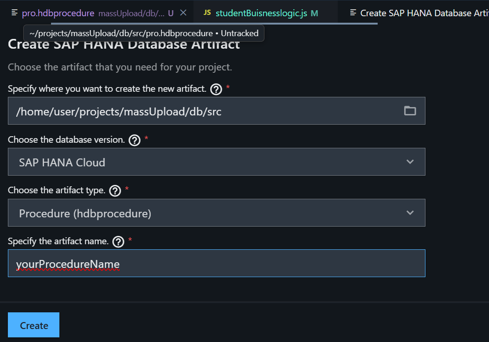

# Getting Started

Welcome to your new project.

It contains these folders and files, following our recommended project layout:

File or Folder | Purpose
---------|----------
`app/` | content for UI frontends goes here
`db/` | your domain models and data go here
`srv/` | your service models and code go here
`package.json` | project metadata and configuration
`readme.md` | this getting started guide

## Next Steps

- Open a new terminal and run `cds watch`
- (in VS Code simply choose _**Terminal** > Run Task > cds watch_)
- Start adding content, for example, a [db/schema.cds](db/schema.cds).

## Learn More

Learn more at https://cap.cloud.sap/docs/get-started/.

<!-- Here is the tutorials for procedures -->

first we need to do 

 1. CTRL + SHIFT + P (open command palet)
 2. create hana DB artifect
 3. create using the below template
    
 4. then create a .hdiconfig file contains below details.

    {
  "file_suffixes": {
    "csv": {
      "plugin_name": "com.sap.hana.di.tabledata.source"
    },
    "hdbcalculationview": {
      "plugin_name": "com.sap.hana.di.calculationview"
    },
    "hdbconstraint": {
      "plugin_name": "com.sap.hana.di.constraint"
    },
    "hdbindex": {
      "plugin_name": "com.sap.hana.di.index"
    },
    "hdbtable": {
      "plugin_name": "com.sap.hana.di.table"
    },
    "hdbtabledata": {
      "plugin_name": "com.sap.hana.di.tabledata"
    },
    "hdbview": {
      "plugin_name": "com.sap.hana.di.view"
    },
    
    "hdbprocedure": {
      "plugin_name": "com.sap.hana.di.procedure"
    }
  }
}

5. some example logics written in the created file

     await cds.run(`CALL "8CC23DED985F4A2F8B315F68F418EBE4"."pro"('${ID}','${Name}','${Roll}','${Class}')`)
            // this one is also okay.
            // await cds.run(
            //     `CALL "8CC23DED985F4A2F8B315F68F418EBE4"."pro"(?,?,?,?)`,
            //     [ID, Name, Roll, Class]
            // );
6. WRITE ON YOUR PROCEDURE FILE LIKE:

    PROCEDURE "pro"(
    IN id INTEGER,
    IN Name NVARCHAR(100),
    IN Roll INTEGER,
    IN Class INTEGER 
)
   LANGUAGE SQLSCRIPT
   SQL SECURITY INVOKER
--    DEFAULT SCHEMA <default_schema_name>
   AS
BEGIN
   /*************************************
       Write your procedure logic
   *************************************/
   INSERT INTO "MY_STUDENTS_STUDENTS"(ID, NAME, ROLL, CLASS)
          VALUES(:id, :Name, :Roll, :Class);
END
